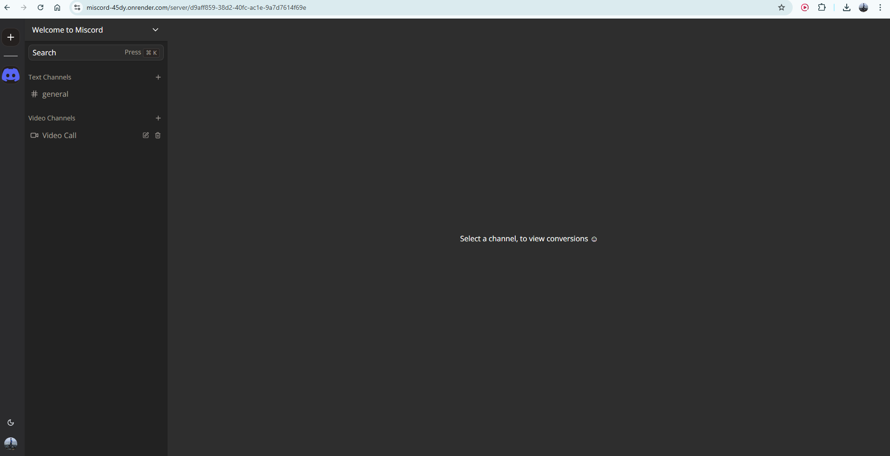
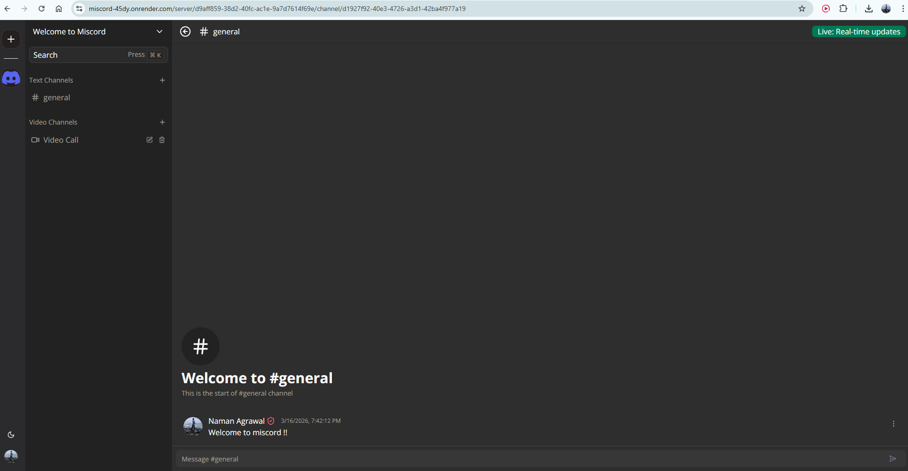

# 🚀 Miscord

**Miscord** is a **Discord-inspired real-time communication platform** where users can create servers, chat in channels, and connect through text and video.

🌐 **Live Demo:**  
https://miscord-45dy.onrender.com/

---

## 📸 Screenshots

### Server Interface

### Channel Chat

### Video Channel

---

## ✨ Features

- 🏠 **Servers** — Create and customize servers
- 📁 **Channels** — Text & Video channels
- 👥 **Invites** — Invite members via shareable links
- 💬 **Real-time Chat** — Instant messaging with WebSockets
- ✏️ **Message Controls** — Edit & delete messages
- 📹 **Video Calls** — Group video communication in channels
- 🛡 **Roles** — Member / Moderator / Admin
- 🔐 **Authentication** — Secure user authentication with Clerk
- 🎨 **Modern UI** — Clean, responsive Discord-style design

---

## 🧪 Try It

1. Join the global server **Welcome to Miscord**
2. Use the invite link: https://miscord-45dy.onrender.com/invite/IMRQp6p0
3. Create channels (or chat in **general** channel) and start chatting.

---

## 🛠 Tech Stack

- **Next.js**
- **TypeScript**
- **tRPC**
- **Drizzle ORM**
- **PostgreSQL**
- **WebSockets**
- **React Query**
- **TailwindCSS**
- **Clerk Authentication**

---

## ⚠️ Deployment Note

Miscord is deployed on **Render** because the app relies on **WebSockets** for real-time communication.  
Vercel's serverless architecture does not support persistent WebSocket connections.

⚡ On the **Render free tier**, the service may take a few seconds to wake up if inactive.

---

⭐ If you like this project, consider **starring the repo**!
